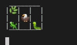
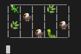
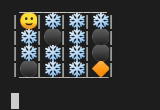
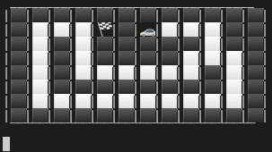
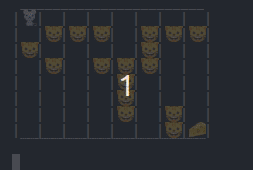

# Q Learning AI

This contains an AI that is trained using Q Learning.
It can simulate simple grid games.
Several games have been included in **/game_templates**.
You can create your own template file to train AI on new games.

## Usage
Help
```
python ql_ai.py -h
```

Run simulation
```bash
python ql_ai.py -t game_templates/<template_file>
```
There are several different game template files in the **game_template** directory
You can create new game teplates in a JSON file with the same structure of other examples.

## Demos

| Name                      |  Demo                   |
:--------------------------:|:------------------------:
lizard_game_template.json   |  
lizard_game2_template.json  |  
frozen_lake_template.json   |  
race_track_template.json    |  
cat_mouse_game_template.json|  

*Demos are recorded in VS code terminal*